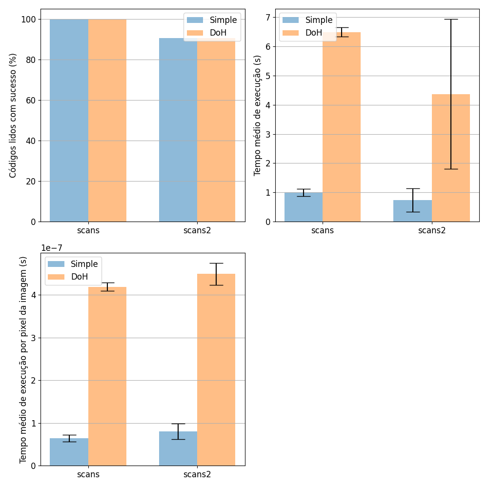

# Multiple Choice Test Reader

Access the full report, in Portuguese, [here](docs/report.pdf).


## Setup

```
pip install -r requirements.txt
```

## Run

```
usage: read_test.py [-h] [--detector {simple,doh}] [--debug] test_image_filename

positional arguments:
  test_image_filename   test image filename

optional arguments:
  -h, --help            show this help message and exit
  --detector {simple,doh}
                        method used to detect keypoints
  --debug               show debug info
```

## Results

